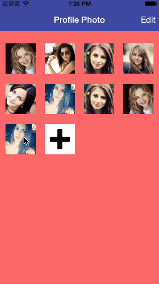

##CBProfilePhotoView
_____

###Features
- plus sign to add photos
- click on the photo to display large photo(either static photo or async load from server) and swipe left/right to navigate
- click edit to remove any photos as you wish

###Implementation basics
- profile photo imageview(position (5px,5px,5px,5px) for the remove button) in collectionviewcell
- single tap gestures binded to each image view
- each image view has tag attribute of [indexpath row] for referencing

###Demo

###Thanks to
[DKImageBrowser](https://github.com/dkhamsing/DKImageBrowser) for the large photo browser view

### LICENSE
MIT license